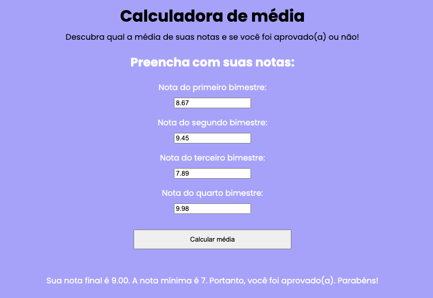

# Calculadora de média

Calculadora de média de notas criada durante a primeira aula da quarta Imersão Dev.

Março de 2022.

## Screenshots

## 🛠 Tecnologias

Javascript, HTML, CSS
 
Você pode testá-la aqui: [https://codepen.io/bifalken/pen/rNYbvzQ](https://codepen.io/bifalken/pen/rNYbvzQ).
